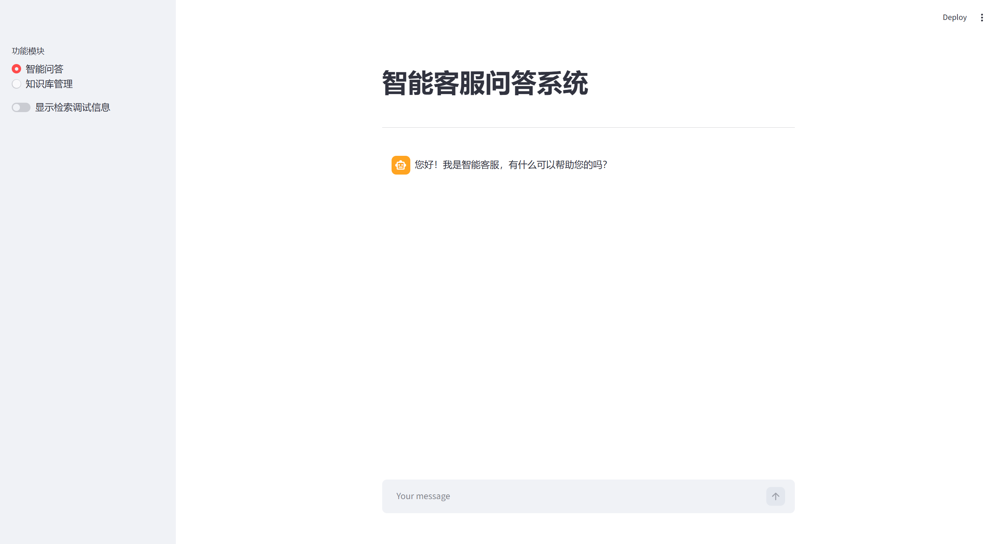
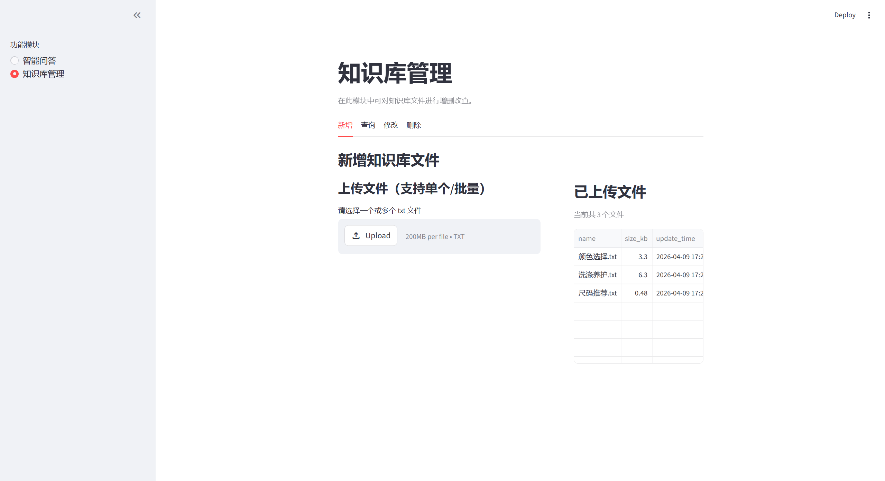

# RAG 知识库问答项目

这是一个适合初学者入门的中文 RAG 示例项目，使用 Streamlit + LangChain + Chroma 搭建。
你可以通过它快速理解 RAG 的完整流程：**上传知识库 -> 向量化 -> 检索 -> 结合大模型回答问题**。

## 适合学习什么

- 什么是 RAG，以及它为什么能减少大模型“胡编”
- 文本如何切分、向量化、入库
- 向量检索是怎么把相关内容找出来的
- Prompt 如何把检索结果和用户问题一起送给大模型
- Streamlit 页面如何把这些能力串起来

## 项目功能

- 智能问答：基于知识库内容进行检索增强回答
- 知识库管理：支持文件新增、查询、修改、删除
- 批量处理：支持单个和批量上传、单个和批量删除
- 聊天历史：保留本地会话记录，方便查看上下文

## 技术栈

- Streamlit：网页界面
- LangChain：RAG 工作流编排
- Chroma：向量数据库
- DashScope / 通义：Embedding 和 Chat 模型

## 快速开始

### 1. 安装依赖

```bash
pip install -r requirements.txt
```

### 2. 启动主界面

```bash
streamlit run app_qa.py
```

启动后可以在左侧切换：

- `智能问答`
- `知识库管理`

### 3. 单独启动知识库管理页

```bash
streamlit run app_file_uploader.py
```

## 页面效果展示

### 1. 智能问答主页



### 2. 知识库管理页



## 学习路径建议

如果你是第一次接触 RAG，建议按这个顺序看代码：

1. 先看 [app_file_uploader.py](app_file_uploader.py)，理解知识库文件如何上传和管理
2. 再看 [knowledge_base.py](knowledge_base.py)，理解文本如何切分、入库和删除
3. 然后看 [vector_stores.py](vector_stores.py)，理解向量检索器如何返回相关文档
4. 接着看 [rag.py](rag.py)，理解检索结果如何和 prompt 结合
5. 最后看 [app_qa.py](app_qa.py)，理解页面如何串起整个问答流程

## 项目结构

- [app_qa.py](app_qa.py)：问答主入口
- [app_file_uploader.py](app_file_uploader.py)：知识库管理页面
- [rag.py](rag.py)：RAG 主链路
- [knowledge_base.py](knowledge_base.py)：知识库入库与维护
- [vector_stores.py](vector_stores.py)：向量检索封装
- [file_history_store.py](file_history_store.py)：聊天历史存储
- [config_data.py](config_data.py)：项目配置
- [requirements.txt](requirements.txt)：依赖列表

## 对初学者的提示

- 先用少量 txt 文件测试，不要一开始就上传太多文档
- 先理解“检索到什么，再回答什么”，不要急着改大模型
- 如果回答不准确，优先检查知识库内容和分块，而不是先改 UI

## 说明

这个项目更适合作为 RAG 入门练习和演示，不是完整的生产级系统。